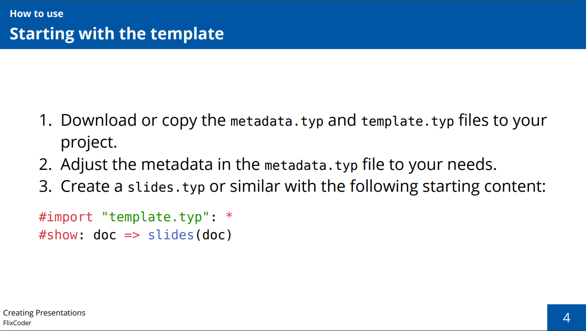

# Typst beamer slides template

A simple to use template for creating presentation slides.

## Usage and Example

Take a look at [`slides.pdf`](https://github.com/FlixCoder/typst-slides/blob/main/slides.pdf) and [`slides.typ`](https://github.com/FlixCoder/typst-slides/blob/main/slides.typ) to see how it looks like and how to use it.

## Typst version

Made with Typst v0.8.0, compiles with v0.9.0 - v0.11.0, it is unclear whether future versions will break something.
